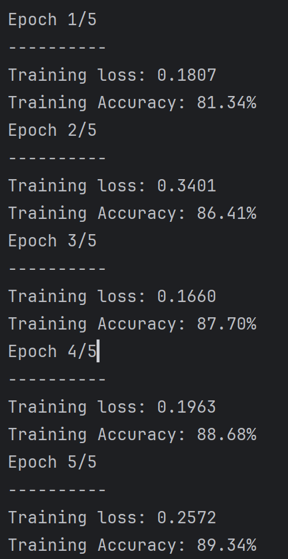
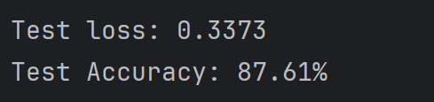
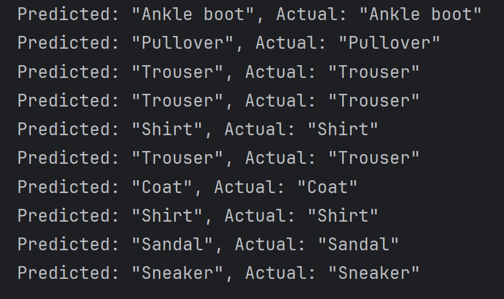

Sure, here's the updated README.md file using the provided model architecture:

# PyTorch Fashion MNIST Project

## Table of Contents
- [Introduction](#introduction)
- [Dataset](#dataset)
- [Model Architecture](#model-architecture)
- [Training](#training)
- [Evaluation](#evaluation)
- [Results](#results)
- [Usage](#usage)
- [Contributing](#contributing)
- [License](#license)

## Introduction
This repository contains a PyTorch project that demonstrates the training and evaluation of a machine learning model on the Fashion MNIST dataset.

## Dataset
The dataset used in this project is the [Fashion MNIST dataset](https://github.com/zalandoresearch/fashion-mnist), a dataset of Zalando's article images consisting of a training set of 60,000 examples and a test set of 10,000 examples. Each example is a 28x28 grayscale image, associated with a label from 10 classes.
- T-shirt/top (label 0)
- Trouser (label 1)
- Pullover (label 2)
- Dress (label 3)
- Coat (label 4)
- Sandal (label 5)
- Shirt (label 6)
- Sneaker (label 7)
- Bag (label 8)
- Ankle boot (label 9)

## Model Architecture
The model used in this project is a fully connected neural network with the following architecture:

```python
NeuralNet(
  (flatten): Flatten()
  (stack): Sequential(
    (0): Linear(in_features=784, out_features=512, bias=True)
    (1): ReLU()
    (2): Linear(in_features=512, out_features=256, bias=True)
    (3): ReLU()
    (4): Linear(in_features=256, out_features=128, bias=True)
    (5): ReLU()
    (6): Linear(in_features=128, out_features=10, bias=True)
  )
)
```

The model consists of a `Flatten` layer to convert the 2D image input into a 1D vector, followed by a stack of fully connected layers with ReLU activations. The final layer has 10 units, corresponding to the 10 fashion classes.

## Training
The model is trained using the Adam optimizer with a learning rate of 0.001. The training is performed for a specified number of epochs, and the training loss and accuracy are monitored during the process.


## Results
The results of the training and evaluation process are visualized in the following images:

### Training Accuracy


### Test Accuracy

### Predictions on Test Data


## Usage
To use this project, follow these steps:

1. Clone the repository: `git clone https://github.com/kzebibi/pytorch-fashion-mnist-project.git`
2. Install the required dependencies: `pip install -r requirements.txt`
3. Run the main script: `python app/main.py`

## Contributing
Contributions to this project are welcome. If you find any issues or have suggestions for improvements, please feel free to open an issue or submit a pull request.

## License
This project is licensed under the [MIT License](LICENSE).
